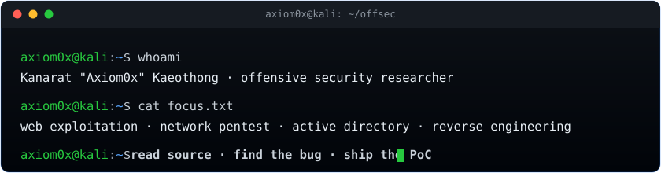

<div align="center">



<h1>Kanarat Kaeothong &nbsp;·&nbsp; <code>Axiom0x</code></h1>

<a href="https://github.com/KiwKNR">
  
</a>

<p>
<a href="https://github.com/KiwKNR/CVE-2026-103978"></a>
<a href="https://github.com/KiwKNR/CVE-2026-104826"></a>


</p>

</div>

I break web apps and networks, audit source code for bugs, and run a small CTF team.
Currently doing red team work at BMSP and teaching cyber-warfare labs for the Royal
Thai Navy on the side.

Day to day I'm in Burp, reading PHP/Python source looking for the thing a dev assumed
no one would ever send, then writing it up with a PoC that actually runs.

```console
axiom0x@kali:~$ whoami
role   red teamer / penetration tester
focus  web exploitation, network pentest, AD, privesc
ctf    web / pwn / rev / crypto, player + trainer
```

## Disclosures

I audit open-source web apps on my own time. Rule I keep: no report goes out without
a working PoC first, and the fix gets coordinated with the maintainer through a GitHub
Security Advisory before anything is public.

| CWE | Class | Severity | Status |
|:--|:--|:-:|:--|
| CWE-22 | Unauthenticated path traversal | High | [CVE-2026-103978](https://github.com/KiwKNR/CVE-2026-103978), GHSA advisory |
| CWE-434 | Unauthenticated file upload to RCE | Critical | reported, fix in progress |
| CWE-22 | Path traversal in chunked upload, file write to RCE | High | [CVE-2026-104826](https://github.com/KiwKNR/CVE-2026-104826), GHSA advisory |

Repo names stay private until a patch ships. CVE numbers go here once they're assigned.

## Certifications

| Cert | Issuer | Note |
|:--|:--|:--|
| CRTeamer, Certified Red Teamer | The SecOps Group | passed with Merit (v1.01) |
| CNPen, Certified Network Pentester | The SecOps Group | passed with Merit |
| CRTA, Certified Red Team Analyst | CyberWarfare Labs | |
| WEB-RTA, Web Red Team Analyst | CyberWarfare Labs | |
| API-RTA, API Red Team Analyst | CyberWarfare Labs | |
| kWAPTA, Web App Pentest Apprentice | Knight Squad Academy | |
| kAPIPTA, API Pentest Apprentice | Knight Squad Academy | |
| Penetration Testing Specialist | NCSA (สกมช.) | 28 hrs |
| Cybersecurity Professional (Advanced) | NCSA (สกมช.) | |
| Cybersecurity Foundation | NCSA (สกมช.) | |
| Cloud Security Standard for Practitioner (TCSAP) | NCSA (สกมช.) | 11 hrs |
| Ethical Hacking & Penetration Testing | FutureSkill | |
| Cybersecurity Fundamentals | FutureSkill | |

## Competitions

**Navy Cyber Fair 2026** ("Ready to Defend, Ready to Dominate") - 1st runner-up in the
Cyber Warrior track (naval personnel level), team CTF. Hands-on cyber operations
contest hosted by the Royal Thai Navy Directorate of Communications and IT. Writeups for the
challenges I solved are in [NAVY-CYBER-FAIR-2026-Writeups](https://github.com/KiwKNR/NAVY-CYBER-FAIR-2026-Writeups).

## Stuff I've built

**SENTINEL-7 CyberRange** - red vs blue range I put together with the SENTINEL-7 team
for Navy training. Each operator gets an isolated Docker container with a loaded
toolset, spins up in a few seconds, live scoreboard for the missions. Live at
[redopsdb.com](https://www.redopsdb.com).

**ELEC CTF Arena** - CTF platform I run for the Navy Electronics Department where I
teach. Server-side flag checking (SHA-256), live board, new labs daily. In production
at [elec-ctf-arena.vercel.app](https://elec-ctf-arena.vercel.app).

[](https://github.com/KiwKNR/Pentest-Vault)
[](https://github.com/KiwKNR/CTF-Vault)

## Tools I live in

Burp Suite, nmap, Metasploit, Wireshark, Ghidra, sqlmap, ffuf, gobuster, httpx,
subfinder, katana, gitleaks, trufflehog, BloodHound, gdb (gef/pwndbg). Mostly Kali,
some Parrot and Arch. Scripting in Python and Bash, bit of C and Go, PowerShell when
the target's Windows.

## What I test

Web is home turf: SQLi, XSS, SSRF, IDOR, auth bypass, file upload, SSTI, deser. APIs
too (BOLA/IDOR, broken auth, mass assignment, JWT). On internal work it's the usual
recon, pivoting, lateral movement, and AD stuff (kerberoasting, pass-the-hash,
BloodHound). Then privesc and post-ex once I'm in.

<br/>


## Security contact

Open a private vulnerability report on the relevant repo, or encrypt to my PGP key
([`pgp.asc`](pgp.asc)):

```
3703 5DDA 7B71 F8CC B1DB  5F2B 3B8F 3468 4648 460A
```
